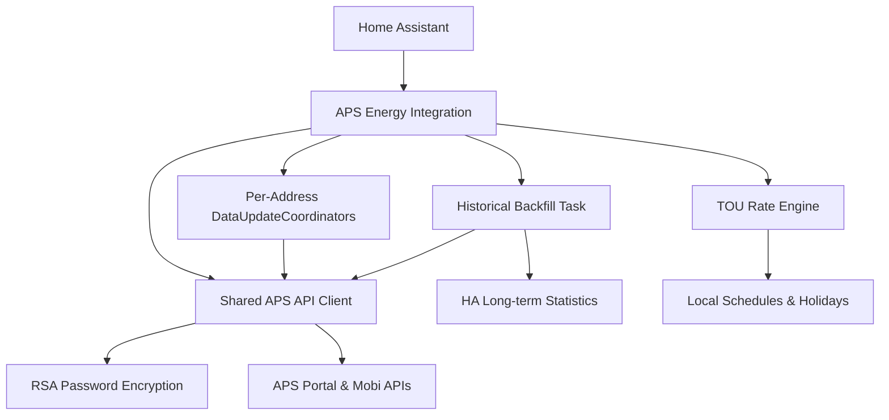

# System Patterns: APS Energy Integration

## Architecture
The integration is built as a Home Assistant **Custom Integration**.

### Component Diagram

## Design Patterns
- **Async Client**: Non-blocking `aiohttp` client with token caching and shared session.
- **Shared Client / Multi-Coordinator**: A single client handles authentication and base data, while multiple coordinators (one per address) manage granular updates to avoid redundant API calls.
- **Looped Config Flow**: A multi-step UI flow that iterates through multiple selections to gather specific metadata (friendly names, import modes) per address.
- **External Statistics**: Usage of `async_add_external_statistics` to inject historical data directly into the HA recorder database.
- **Separation of Concerns**:
    - `api.py`: Low-level HTTP, auth, and endpoint parsing.
    - `coordinator.py`: Data lifecycle and polling logic.
    - `backfill.py`: One-time historical data ingestion.
    - `rate_engine.py`: (Planned) Local ToU logic.
    - `sensor.py`: Entity definitions and state mapping.

## Directory Structure
- `custom_components/aps_energy/`:
    - `api.py`: Auth and all API call logic.
    - `backfill.py`: Historical data migration.
    - `config_flow.py`: Multi-step, multi-address setup UI.
    - `coordinator.py`: Data fetch management.
    - `sensor.py`: Sensor entity matrix.
    - `translations/en.json`: UI labels and instructions.
- `scripts/`:
    - `capture_traffic.py`: Browser-based API discovery tool.
    - `probe_usage.py`: API endpoint validation script.
