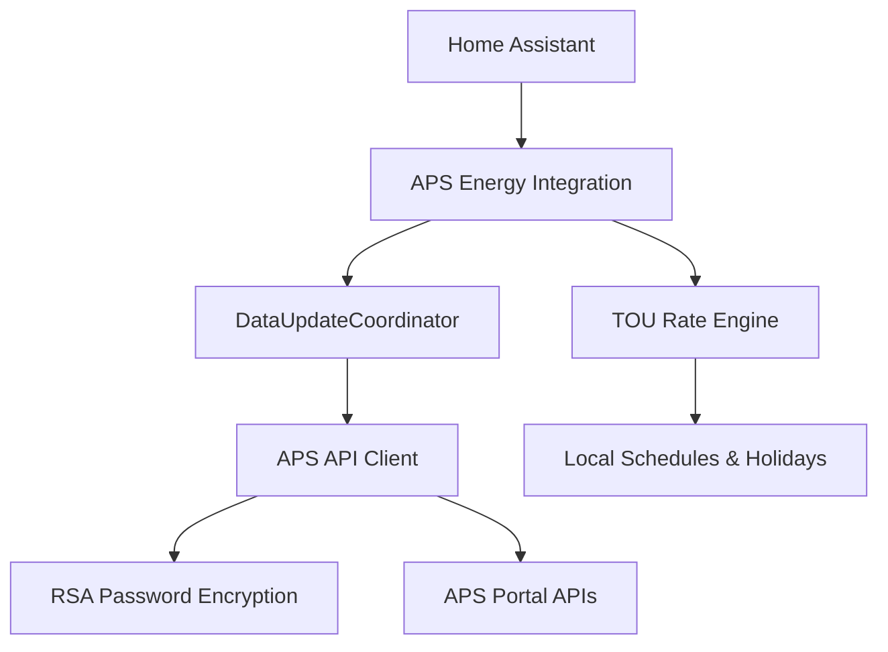

# System Patterns: APS Energy Integration

## Architecture
The integration is built as a Home Assistant **Custom Integration**.

### Component Diagram

## Design Patterns
- **Async Client**: Non-blocking `aiohttp` client for portal interaction.
- **Polling Coordinator**: Centralized data management in HA to avoid redundant API calls.
- **Separation of Concerns**:
    - `aps_client.py`: Handles raw HTTP/auth.
    - `rate_engine.py`: Handles local rate calculation logic.
    - `sensor.py`: Maps data to HA entities.
- **Session Persistence**: Maintaining cookies/sessions to minimize re-authentication.

## Directory Structure
- `aps_client.py`: Standalone client for auth and data.
- `discover_apis.py`: Tool for reverse-engineering portal endpoints.
- `custom_components/aps_energy/`: Root for HA integration files.
- `tests/`: Automated test suite.
